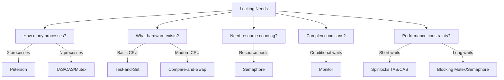
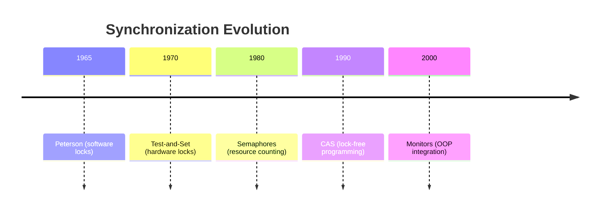

### The Core Insight: Why Different "Locks" Exist

 **all synchronization mechanisms fundamentally provide locking**. But they solve different *dimensions* of locking problems. Think of them as different types of "locks" for different scenarios:



### Key Differences Explained Through Problems

#### 1. **Problem: Two Chess AIs Sharing a Board**
   - **Why Peterson?**  
     Only 2 processes, educational context  
     ```c
     // Process 0
     flag[0] = true; turn = 1;
     while (flag[1] && turn == 1);  // Wait
     make_move();                   // Critical section
     flag[0] = false;
     ```

#### 2. **Problem: 100 Robots Grabbing Tools from a Shelf**
   - **Why Test-and-Set?**  
     Simple contention, short operations  
     ```c
     while (test_and_set(&tool_lock));  // Spin
     grab_tool();
     tool_lock = false;
     ```

#### 3. **Problem: "Only 5 Users Allowed in VIP Lounge"**
   - **Why Semaphore?**  
     Resource counting needed  
     ```c
     sem_wait(&vip_slots);  // Decrement count
     enter_lounge();
     sem_post(&vip_slots);  // Increment count
     ```

#### 4. **Problem: "Withdraw Cash Only If Balance > $100"**
   - **Why Monitor?**  
     Complex condition + encapsulation  
     ```java
     monitor Account {
         void withdraw(int amt) {
             while (balance < amt) wait(funds);
             balance -= amt;
         }
         void deposit(int amt) {
             balance += amt;
             signal(funds);
         }
     }
     ```

#### 5. **Problem: "Update CPU Cache Without Locking"**
   - **Why Compare-and-Swap?**  
     Need lock-free atomic updates  
     ```c
     do {
         old_cache = current_cache;
         new_cache = calculate_update(old_cache);
     } while (!CAS(&current_cache, old_cache, new_cache));
     ```

### Why Not One Universal Lock?
1. **Performance Tradeoffs**  
   - Spinlocks (TAS) waste CPU but fast for nano-second operations
   - Blocking locks (Mutex) save CPU but add context-switch overhead

2. **Problem Complexity**  
   - Binary state? → Mutex/TAS  
   - Resource pool? → Semaphore  
   - Conditional wait? → Monitor  
   - Lock-free? → CAS

3. **Hardware Constraints**  
   - Older CPUs: Only support TAS  
   - Modern CPUs: CAS available

4. **Correctness vs Control**  
   - Low-level (TAS/CAS): More control, harder to use correctly  
   - High-level (Monitor): Safer, less control

### Evolution of Locks


While all provide locking, we need different solutions for:
- Different hardware capabilities
- Different contention patterns
- Different performance needs
- Different complexity levels

The "best" lock depends on your specific problem constraints - that's why OS courses teach them all!