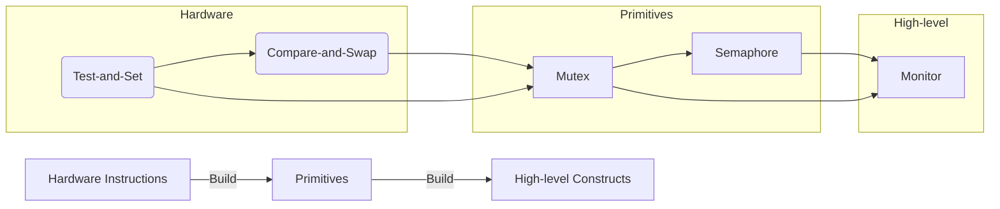

Here's a concise comparison figure summarizing all synchronization mechanisms discussed, highlighting their key characteristics, use cases, and relationships:

### Synchronization Mechanisms Comparison
```plaintext
┌───────────────────┬─────────────────┬────────────────────┬───────────────────┬───────────────────┐
│   Mechanism       │   Type/Level    │ Key Implementation │  Primary Use Case │  Limitations      │
├───────────────────┼─────────────────┼────────────────────┼───────────────────┼───────────────────┤
│                   │                 │  Software-only     │                   │ Only works for    │
│ Peterson's        │  Algorithm      │  (flags + turn     │  Educational      │ 2 processes;      │
│ Solution          │  (SW)           │  variable)         │  examples         │ Reordering issues │
├───────────────────┼─────────────────┼────────────────────┼───────────────────┼───────────────────┤
│                   │                 │  Hardware atomic   │                   │ Busy-waiting;     │
│ Test-and-Set      │  Instruction    │  read-modify-write │  Spinlocks,       │ Only binary       │
│ (TAS)             │  (HW)           │  operation         │  simple mutexes   │ state management  │
├───────────────────┼─────────────────┼────────────────────┼───────────────────┼───────────────────┤
│                   │                 │  Hardware atomic   │  Lock-free        │                   │
│ Compare-and-Swap  │  Instruction    │  compare + update  │  structures,      │ ABA problem;      │
│ (CAS)             │  (HW)           │  with condition    │  atomic counters  │ More complex      │
├───────────────────┼─────────────────┼────────────────────┼───────────────────┼───────────────────┤
│                   │  Synchronization│  Built on TAS/CAS  │                   │ Only owner can    │
│ Mutex Lock        │  Primitive      │  with ownership    │  Short critical   │ unlock; Busy-wait │
│                   │  (SW/HW hybrid) │  concept           │  sections         │ or context switch │
├───────────────────┼─────────────────┼────────────────────┼───────────────────┼───────────────────┤
│                   │  Synchronization│  Built on TAS/CAS  │  Resource pools,  │                   │
│ Semaphore         │  Primitive      │  with counter and  │  producer-        │ Error-prone       │
│                   │  (SW/HW hybrid) │  waiting queue     │  consumer problems│ signaling         │
├───────────────────┼─────────────────┼────────────────────┼───────────────────┼───────────────────┤
│                   │  High-level     │  Uses mutexes +    │  Complex shared   │ Requires          │
│ Monitor           │  Construct      │  condition         │  data structures  │ language support  │
│                   │  (SW)           │  variables         │  (OOP)            │                   │
└───────────────────┴─────────────────┴────────────────────┴───────────────────┴───────────────────┘
```

### Key Relationships:


### Core Principles Summary:
1. **Evolution Path**:
   - Hardware (TAS/CAS) → Primitives (Mutex/Semaphore) → High-level (Monitor)
   - Higher levels provide safer abstraction but less control

2. **Atomicity Guarantees**:
   - HW: Single-instruction atomic ops (TAS/CAS)
   - SW: Build on HW with algorithms (Peterson) or queues (Semaphore)

3. **Blocking Behavior**:
   - Spinlocks (TAS): Waste CPU but fast
   - Sleep/wake (Semaphore/Monitor): Efficient but context-switch overhead

4. **Correctness vs Performance**:
   - Low-level (HW): High performance, hard to use correctly
   - High-level (Monitor): Safer, easier to use, less control

### When to Use Which:
| Scenario                      | Recommended Mechanism |
|-------------------------------|------------------------|
| Simple mutual exclusion       | Mutex                 |
| Resource counting             | Semaphore             |
| Lock-free programming         | CAS                   |
| Object-oriented shared data   | Monitor               |
| Educational purposes          | Peterson/Semaphore    |
| Kernel development            | TAS/CAS               |

This comparison shows how each solution builds upon others while addressing specific synchronization challenges - from hardware-level atomic operations to high-level programming constructs.